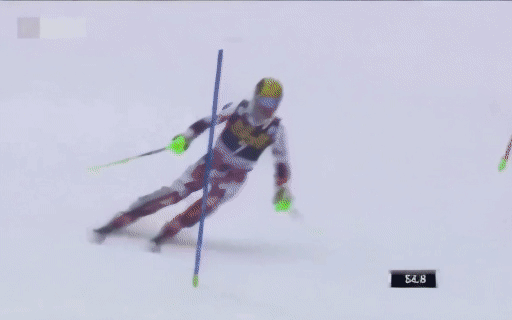

## ___***TVG: A Training-free Transition Video Generation Method with Diffusion Models***___

## Introduction

TVG is a training-free transition video generation method. It can enhance the video generation performance of models under the condition of generating videos given the initial and final frames.


Transition videos play a crucial role in media production, enhancing the flow and coherence of visual narratives. Traditional methods like morphing often lack artistic appeal and require specialized skills, limiting their effectiveness. Recent advances in diffusion model-based video generation offer new possibilities for creating transitions but face challenges such as poor inter-frame relationship modeling and abrupt content changes. We propose a novel training-free Transition Video Generation (TVG) approach using video-level diffusion models that addresses these limitations without additional training. Our method leverages Gaussian Process Regression (GPR) to model latent representations, ensuring smooth and dynamic transitions between frames. Additionally, we introduce interpolation-based conditional controls and a Frequency-aware Bidirectional Fusion (FBiF) architecture to enhance temporal control and transition reliability. Evaluations of benchmark datasets and custom image pairs demonstrate the effectiveness of our approach in generating high-quality smooth transition videos.


## ⚙️ Setup


### Install Environment via Anaconda (Recommended)
```bash
conda create -n TVG python=3.8.5
conda activate TVG
pip install -r requirements.txt
```

### Preparation
Please follow the instructions on [DynamiCrafter](https://github.com/Doubiiu/DynamiCrafter) to download the [DynamiCrafter512_interp](https://huggingface.co/Doubiiu/DynamiCrafter_512_Interp/blob/main/model.ckpt) model and place it in the `checkpoints/dynamicrafter_512_interp_v1/model.ckpt` path.

### Dataset
We used the [MorphBench](https://github.com/Kevin-thu/DiffMorpher) and the [TC-Bench-I2V](https://github.com/weixi-feng/TC-Bench/). Please download the MorphBench dataset and place it in `EvalData/MorphBench/Animation` and `EvalData/MorphBench/Metamorphosis`. For the TC-Bench-I2V dataset, please follow the official tutorial and save the final frames to the `EvalData/TC-Bench/youtube_videos_frames` directory. You can refer to the corresponding files in the Prompts for specific paths. The images we collected ourselves are already in the `EvalData` directory.

## 💫 Inference

To reproduce the experiments from the paper, please run
```bash
bash paper_exp.sh
```
in the command line.

## Results


|  |  |  |
|----------|----------|----------|
|  |  |  |
|  |  |  |
|  |  |  |
|  |  |  |
|  |          |          |


## 🖊️ Citation

Please kindly cite our paper if you use our code, data, models or results:
```bibtex
@inproceedings{zhang2024tvg,
        title = {TVG: A Training-free Transition Video Generation Method with Diffusion Models},
        author = {Rui Zhang and Chen Yaosen and Yuegen Liu and  Wei Wang and Xuming Wen and  Hongxia Wang},
        year = {2024},
        booktitle = {arxiv}
}
bibtex```


## 💞 Acknowledgements
Thanks for the work of [DynamiCrafter](https://github.com/Doubiiu/DynamiCrafter). Our code is based on the implementation of them.